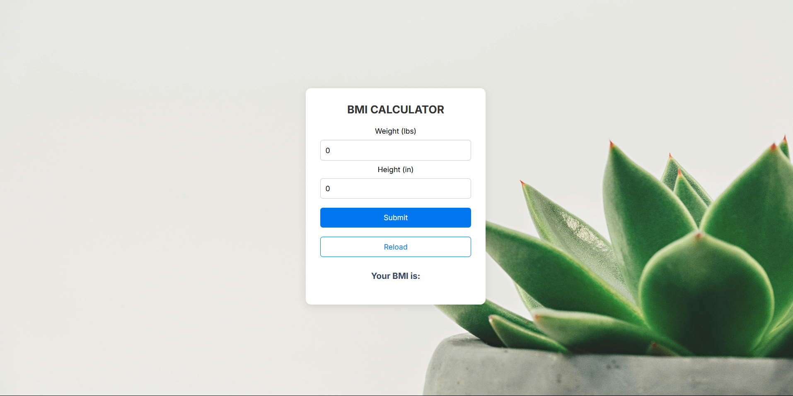

# 🏋️‍♂️ BMI Calculator App

A simple **BMI (Body Mass Index) Calculator** built with **React** using **Hooks** to help users easily calculate their BMI and understand their health category.

---

## 🚀 Features

- 📏 **BMI Calculation** based on user input (weight & height)  
- ⚡ **Real-time updates** using **React Hooks** (`useState`, `useEffect`)  
- 🎨 Clean and responsive UI  
- 📊 BMI Result with health status (Underweight, Normal, Overweight, Obese)

---

## 🔧 Built With

- ⚛ **React** (with Hooks)  
- 💅 **CSS** for styling  
- 🛠 **Vite** as the build tool

---

## 📸 Screenshots



---

## 🧮 How to Run the App

1. **Clone the repository**  
   ```bash
   git clone https://github.com/Sai-krishnaa/React-Projects.git
   cd React-Projects/Bmi_cal
